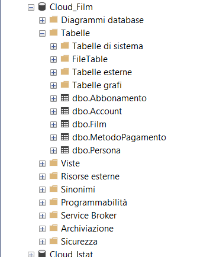
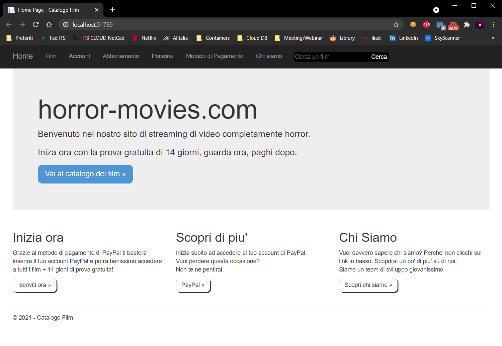
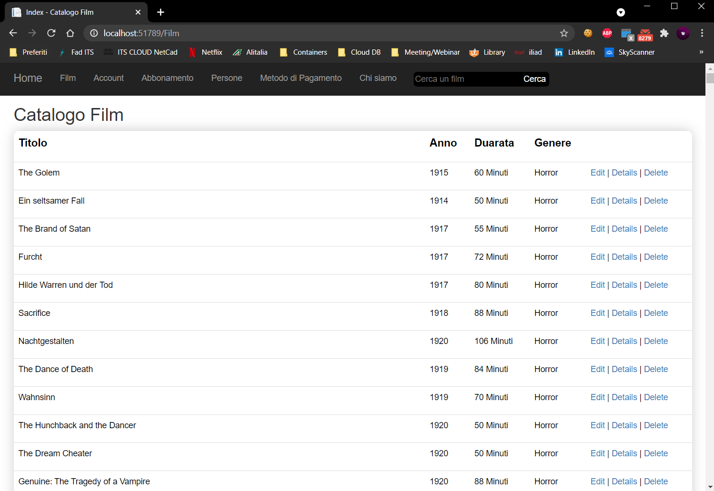
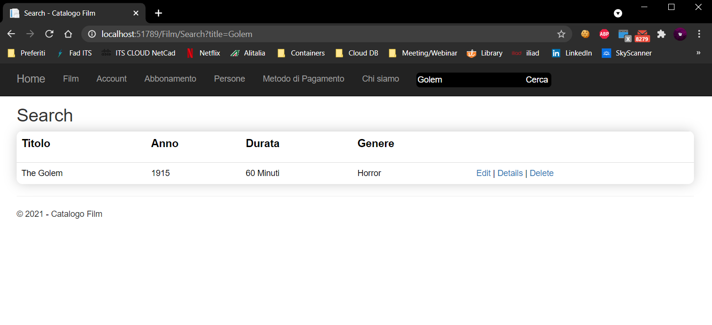

# MVC_FILM_STREAMING
## _A streaming website coded on ASP .NET Framework Microsoft_
</br>

[](https://docs.microsoft.com/it-it/aspnet/core/?view=aspnetcore-5.0)

## Introduction

- Streaming like Netflix, but coded on MVC ASP .NET Core
- Database on Microsft SQL Server

## Software that I used
 [Visual Studio Community 2019](https://visualstudio.microsoft.com)</br>
 [ASP .NET Core Framwerok MIcrosft (MVC)](https://docs.microsoft.com/it-it/aspnet/core/tutorials/first-mvc-app/start-mvc?view=aspnetcore-5.0&tabs=visual-studio)</br>
 [Microsft SQL Server](https://docs.microsoft.com/it-it/sql/ssms/download-sql-server-management-studio-ssms?view=sql-server-ver15)

</br>

## Installation

Dillinger requires [ASP .NET Core](https://docs.microsoft.com/it-it/aspnet/core/tutorials/first-mvc-app/start-mvc?view=aspnetcore-5.0&tabs=visual-studio) to install some components to view the ASP .NET Core libraries.
</br>

## Plugins

Dillinger is currently extended with the following plugins.
Instructions on how to use them in your own application are linked below.

| Plugin | README |
| ------ | ------ |
| Dropbox | [plugins/dropbox/README.md][PlDb] |
| GitHub | [plugins/github/README.md][PlGh] |
| Google Drive | [plugins/googledrive/README.md][PlGd] |
| OneDrive | [plugins/onedrive/README.md][PlOd] |
| Medium | [plugins/medium/README.md][PlMe] |
| Google Analytics | [plugins/googleanalytics/README.md][PlGa] |
</br>

## Code

Sample FilmController.cs (Access to database installed on SQL Server, and controll the Film table inside):

```cs
using System;
using System.Collections.Generic;
using System.Data;
using System.Data.Entity;
using System.Linq;
using System.Net;
using System.Threading.Tasks;
using System.Web;
using System.Web.Mvc;
using MVC_Film.Models;

namespace MVC_Film.Views
{
    public class FilmController : Controller
    {
        private Cloud_FilmEntities db = new Cloud_FilmEntities();

        // GET: Film
        public ActionResult Index()
        {
            return View(db.Film.ToList());
        }

        // GET: Film/Details/5
        public ActionResult Details(string id)
        {
            if (id == null)
            {
                return new HttpStatusCodeResult(HttpStatusCode.BadRequest);
            }
            Film film = db.Film.Find(id);
            if (film == null)
            {
                return HttpNotFound();
            }
            return View(film);
        }

        // GET: Film/Create
        public ActionResult Create()
        {
            return View();
        }

        // POST: Film/Create
        // Per la protezione da attacchi di overposting, abilitare le proprietà a cui eseguire il binding. 
        // Per altri dettagli, vedere https://go.microsoft.com/fwlink/?LinkId=317598.
        [HttpPost]
        [ValidateAntiForgeryToken]
        public ActionResult Create([Bind(Include = "tconst,typeTitle,primaryTitle,originalTitle,startYear,runtimeMinutes,genres")] Film film)
        {
            if (ModelState.IsValid)
            {
                db.Film.Add(film);
                db.SaveChanges();
                return RedirectToAction("Index");
            }

            return View(film);
        }

        // GET: Film/Edit/5
        public ActionResult Edit(string id)
        {
            if (id == null)
            {
                return new HttpStatusCodeResult(HttpStatusCode.BadRequest);
            }
            Film film = db.Film.Find(id);
            if (film == null)
            {
                return HttpNotFound();
            }
            return View(film);
        }

        // POST: Film/Edit/5
        // Per la protezione da attacchi di overposting, abilitare le proprietà a cui eseguire il binding. 
        // Per altri dettagli, vedere https://go.microsoft.com/fwlink/?LinkId=317598.
        [HttpPost]
        [ValidateAntiForgeryToken]
        public ActionResult Edit([Bind(Include = "tconst,typeTitle,primaryTitle,originalTitle,startYear,runtimeMinutes,genres")] Film film)
        {
            if (ModelState.IsValid)
            {
                db.Entry(film).State = EntityState.Modified;
                db.SaveChanges();
                return RedirectToAction("Index");
            }
            return View(film);
        }

        // GET: Film/Delete/5
        public ActionResult Delete(string id)
        {
            if (id == null)
            {
                return new HttpStatusCodeResult(HttpStatusCode.BadRequest);
            }
            Film film = db.Film.Find(id);
            if (film == null)
            {
                return HttpNotFound();
            }
            return View(film);
        }

        // POST: Film/Delete/5
        [HttpPost, ActionName("Delete")]
        [ValidateAntiForgeryToken]
        public ActionResult DeleteConfirmed(string id)
        {
            Film film = db.Film.Find(id);
            db.Film.Remove(film);
            db.SaveChanges();
            return RedirectToAction("Index");
        }

        public ActionResult Search(string title)
        {
            if (title == null)
            {
                return new HttpStatusCodeResult(HttpStatusCode.BadRequest);
            }
            var elenco = db.Film.Where(x => x.primaryTitle.Contains(title)).ToList();
            if (title == null)
            {
                return HttpNotFound();
            }
            return View(elenco);
        }


        protected override void Dispose(bool disposing)
        {
            if (disposing)
            {
                db.Dispose();
            }
            base.Dispose(disposing);
        }
    }
}
```

</br>

## Layout Website (chstml, C#, CSS)

*(cshtml, NOT HTML!!!)*

```html
<!DOCTYPE html>
<html>
<head>
<meta http-equiv="Content-Type" content="text/html; charset=utf-8"/>
    <meta charset="utf-8" />
    <meta name="viewport" content="width=device-width, initial-scale=1.0">
    <title>@ViewBag.Title - Catalogo Film</title>
    @Styles.Render("~/Content/css")
    @Scripts.Render("~/bundles/modernizr")
    
</head>
<body>
    <div class="navbar navbar-inverse navbar-fixed-top">
        <div class="container">
            <div class="navbar-header">
                <button type="button" class="navbar-toggle" data-toggle="collapse" data-target=".navbar-collapse">
                    <span class="icon-bar"></span>
                    <span class="icon-bar"></span>
                    <span class="icon-bar"></span>
                </button>
                @Html.ActionLink("Home", "Index", "Home", new { area = "" }, new { @class = "navbar-brand" })
            </div>
            <div class="navbar-collapse collapse">
                <ul class="nav navbar-nav">
                    <li>@Html.ActionLink("Film", "Index", "Film")</li>
                    <li>@Html.ActionLink("Account", "Index", "Account")</li>
                    <li>@Html.ActionLink("Abbonamento", "Index", "Abbonamento")</li>
                    <li>@Html.ActionLink("Persone", "Index", "Persona")</li>
                    <li>@Html.ActionLink("Metodo di Pagamento", "Index", "MetodoPagamento")</li>
                    <li>@Html.ActionLink("Chi siamo", "About", "Home")</li>
                    <li>
                        @using (Html.BeginForm("Search", "Film", FormMethod.Get))
                        {
                            <ul class="nav navbar-nav" style="margin: 14px;">
                                <li>@Html.TextBox("title", "" , new { placeholder = "Cerca un film" })</li>
                                <li><input type="submit" value="Cerca"/></li>
                            </ul>
                        }
                    </li>
                </ul>
            </div>
        </div>
    </div>
    <div class="container body-content">
        @RenderBody()
        <hr />
        <footer>
            <p>&copy; @DateTime.Now.Year - Catalogo Film</p>
        </footer>
    </div>

    @Scripts.Render("~/bundles/jquery")
    @Scripts.Render("~/bundles/bootstrap")
    @RenderSection("scripts", required: false)
</body>
</html>
```

</br>

## Database on SQL Server


</br>

## Webiste Preview

```html
_layout.cshtml
```


</br>

```html
Index.cshtml <!--Index film FilmController.cs-->
```


</br>

```html
Search.cshtml <!--Search.cshtml SearchController.cs-->
```


</br>

## License

MIT

**Free Software, Hell Yeah!**
</br>

## MyRepo

[My Repo MVC_FILM on GitHub](https://github.com/FraCata00/MVC_Film)